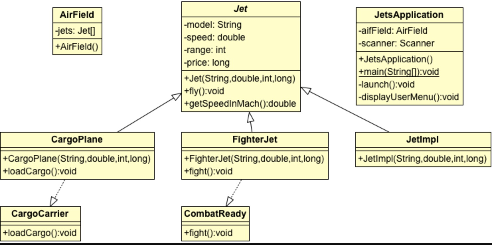

## Jets Project

### Skill Distillery Week 3 - Weekend Homework

Description
This project tracks and manipulates an inventory of jets which are read in from a text file. In this assignment we practiced using inheritance, constructors, autogenerated code and interfaces according to the diagram below. There is a menu and instructions to help the user understand and utilized the options available. 

The user is able to list the jet inventory, view the fly time of a particular jet, display the fastest jet, display the jet with the longest range, use cargo-related or fighter-related functions, add or remove a jet from inventory and quit the program.

After many functions that alter the inventory, the complete inventory is redisplayed.

This program does *not* do input validation to make sure the values entered are reasonable. That would be a great feature to add, although this version does meet the stated requirements.

#### Technologies Used
1. Reading test from a file.
2. Inheritance
3. Interfaces
4. Constructors and methods
5. Menu choices
6. String builder
7. Try/catch

#### Lessons Learned
1. Teamwork speeds up the process immensely. There was a lot of knowledge sharing.
2. This project helped me understand a lot more how to implement constructors, use the automated tools in eclipse to assist in writing the program, how to use an interface, how to input a file and the other material that we have learned over the past week.
3. My appreciation for our instructors' help only grows with every assignment!

#### UML Diagram

